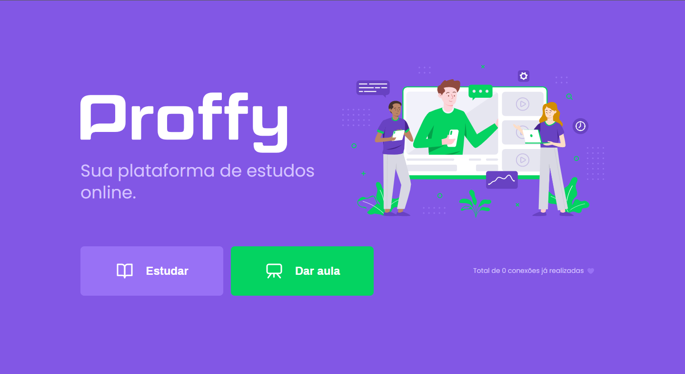
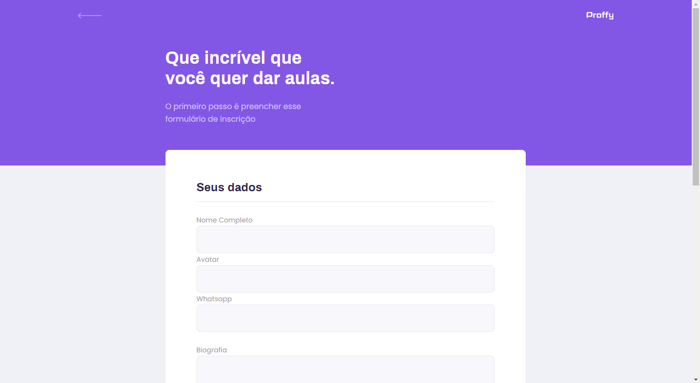
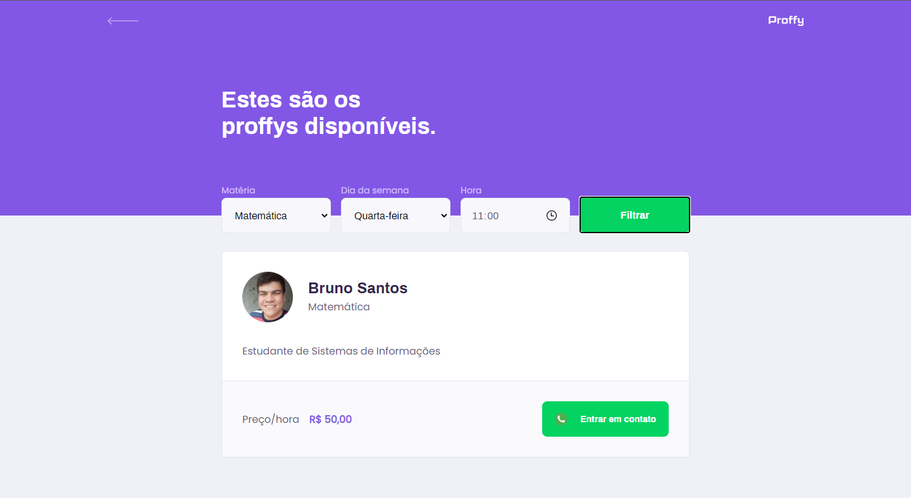

<h1 align="center">
    
</h1>

<h4 align="center"> 
	🚧  Proffy 📖 Concluído 🚀 🚧
</h4>

<p align="center">
 <a href="#-sobre-o-projeto">Sobre</a> •
 <a href="#-funcionalidades">Funcionalidades</a> •
 <a href="#-layout">Layout</a> • 
 <a href="#-como-executar-o-projeto">Como executar</a> • 
 <a href="#-tecnologias">Tecnologias</a> • 
 <a href="#-contribuidores">Contribuidores</a> • 
 <a href="#-autor">Autor</a> • 
 <a href="#user-content--licença">Licença</a>
</p>


## 💻 Sobre o projeto

📖 Proffy é uma plataforma de estudos com o intuito de facilitar o encontro de alunos e professores(proffys)


Projeto desenvolvido durante a **NLW - Next Level Week** oferecida pela [Rocketseat](https://blog.rocketseat.com.br/primeira-next-level-week/).
O NLW é uma experiência online com muito conteúdo prático, desafios e hacks onde o conteúdo fica disponível durante uma semana.

---

## ⚙️ Funcionalidades

- [x] Professores podem se cadastrar na plataforma web enviando:
  - [x] seus dados pessoais (nome, biografia, whatsapp)
  - [x] em qual matéria ira proporcionar aulas
  - [x] qual os dias e horários disponíveis para as aulas

- [x] Os usuários tem acesso ao aplicativo móvel e à plataforma web, onde podem:
  - [x] filtrar os proffys pela matéria, dia e hora para a aula
  - [x] entrar em contato com o professor através do WhatsApp
  - [x] escolher seus proffys como favoritos
  
---

## 🎨 Layout

### Web

<p align="center" style="display: flex; align-items: flex-start; justify-content: center;">
  
  
  
</p>

---

## 🚀 Como executar o projeto

Este projeto é divido em três partes:
1. Backend (pasta server) 
2. Frontend (pasta web)
3. Mobile (pasta mobile)

💡Tanto o Frontend quanto o Mobile precisam que o Backend esteja sendo executado para funcionar.

### Pré-requisitos

Antes de começar, você vai precisar ter instalado em sua máquina as seguintes ferramentas:
[Git](https://git-scm.com), [Node.js](https://nodejs.org/en/). 
Além disto é bom ter um editor para trabalhar com o código como [VSCode](https://code.visualstudio.com/)

#### 🎲 Rodando o Backend (servidor)

```bash

# Clone este repositório
$ git clone https://github.com/brhenriq/Proffy

# Acesse a pasta do projeto no terminal/cmd
$ cd Proffy

# Vá para a pasta server
$ cd server

# Instale as dependências
$ npm install

# Cire o banco sqlite
$ npm run knex:migrate

# Execute a aplicação
$ npm start

# O servidor inciará na porta:3333 - acesse http://localhost:3333 

```

#### 🧭 Rodando a aplicação web (Frontend)

```bash

# Clone este repositório
$ git clone https://github.com/brhenriq/Proffy

# Acesse a pasta do projeto no seu terminal/cmd
$ cd Proffy

# Vá para a pasta da aplicação Front End
$ cd web

# Instale as dependências
$ npm install

# Execute a aplicação em modo de desenvolvimento
$ npm run start

# A aplicação será aberta na porta:3000 - acesse http://localhost:3000

```

---

## 🛠 Tecnologias

As seguintes ferramentas foram usadas na construção do projeto:

#### **Website**  ([React](https://reactjs.org/)  +  [TypeScript](https://www.typescriptlang.org/))

-   **[React Router Dom](https://github.com/ReactTraining/react-router/tree/master/packages/react-router-dom)**
-   **[React Icons](https://react-icons.github.io/react-icons/)**
-   **[Axios](https://github.com/axios/axios)**

> Veja o arquivo  [package.json](https://github.com/brhenriq/Proffy/blob/master/web/package.json)

#### **Server**  ([NodeJS](https://nodejs.org/en/)  +  [TypeScript](https://www.typescriptlang.org/))

-   **[Express](https://expressjs.com/)**
-   **[CORS](https://expressjs.com/en/resources/middleware/cors.html)**
-   **[KnexJS](http://knexjs.org/)**
-   **[SQLite](https://github.com/mapbox/node-sqlite3)**
-   **[ts-node](https://github.com/TypeStrong/ts-node)**

> Veja o arquivo  [package.json](https://github.com/brhenriq/Proffy/blob/master/server/package.json)

#### **Mobile**  ([React Native](http://www.reactnative.com/)  +  [TypeScript](https://www.typescriptlang.org/))

-   **[Expo](https://expo.io/)**
-   **[Expo Google Fonts](https://github.com/expo/google-fonts)**
-   **[React Navigation](https://reactnavigation.org/)**
-   **[Axios](https://github.com/axios/axios)**

> Veja o arquivo  [package.json](https://github.com/brhenriq/Proffy/blob/master/mobile/package.json)

#### **Utilitários**

-   Protótipo:  **[Figma](https://www.figma.com/)** 
-   Editor:  **[Visual Studio Code](https://code.visualstudio.com/)**  → Extensions:  **[SQLite](https://marketplace.visualstudio.com/items?itemName=alexcvzz.vscode-sqlite)**
-   Commit Conventional:  **[Commitlint](https://github.com/conventional-changelog/commitlint)**
-   Teste de API:  **[Insomnia](https://insomnia.rest/)**
-   Fontes:  **[Archivo](https://fonts.google.com/specimen/Archivo)**,  **[Poppins](https://fonts.google.com/specimen/Poppins)**


## 💪 Como contribuir para o projeto

1. Faça um **fork** do projeto.
2. Crie uma nova branch com as suas alterações: `git checkout -b my-feature`
3. Salve as alterações e crie uma mensagem de commit contando o que você fez: `git commit -m "feature: My new feature"`
4. Envie as suas alterações: `git push origin my-feature`

---

## 🦸 Autor

<a href="https://github.com/brhenriq">
 
 <br />
 </a>
 <sub><b>Bruno Santos</b></sub>
 <br />

[](https://www.linkedin.com/in/bruno-henrique-pereira-dos-santos-880561163/) 
[](mailto:brunohqsantos@gmail.com)
